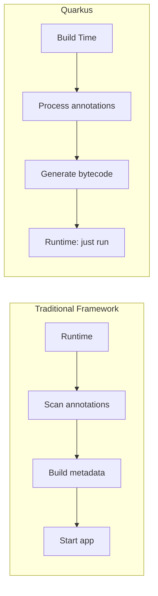

# The Quarkus Approach: Build-Time Processing

``

## The Core Idea

The single most important concept in Quarkus: shift framework work from runtime to build time.

In traditional frameworks (Spring, Jakarta EE), the application JAR contains metadata -- annotations, XML, properties -- that must be scanned and resolved every time the application starts. This happens at runtime, in every deployment, on every restart.

Quarkus moves the vast majority of this work to the build phase.



## What Moves to Build Time

- **Annotation processing:** `@Path`, `@GET`, `@Inject`, `@ConfigProperty` -- scanned and registered during build. The running app never re-scans.
- **Bean discovery and DI wiring:** The CDI bean graph is computed during build. At runtime, the container instantiates pre-resolved beans.
- **Configuration resolution:** Static properties are baked in. Only runtime-overridable properties (env vars, system properties) are resolved at startup.
- **Extension metadata:** Each extension registers capabilities during build. The runtime loads only what was resolved.
- **Native image metadata:** Extensions automatically register classes, methods, and resources that GraalVM needs.

## What Stays at Runtime

- Request handling, business logic, database queries
- Runtime config overrides (env vars, ConfigMaps)
- Connection pool initialization
- Application state (caches, sessions)

## Traditional vs Quarkus Pipeline

```mermaid
flowchart LR
    subgraph Traditional["Traditional Framework"]
        direction TB
        T1["Source Code"] --> T2["Compile to Bytecode"]
        T2 --> T3["Package JAR"]
        T3 --> T4["Deploy to Container"]
        T4 --> T5["Runtime: Classpath Scanning"]
        T5 --> T6["Runtime: Bean Discovery"]
        T6 --> T7["Runtime: Annotation Processing"]
        T7 --> T8["Runtime: Config Resolution"]
        T8 --> T9["Runtime: DI Wiring"]
        T9 --> T10["Application Ready"]
    end

    subgraph Quarkus["Quarkus"]
        direction TB
        Q1["Source Code"] --> Q2["Compile to Bytecode"]
        Q2 --> Q3["Build-Time: Annotation Processing"]
        Q3 --> Q4["Build-Time: Bean Discovery"]
        Q4 --> Q5["Build-Time: Config Resolution"]
        Q5 --> Q6["Build-Time: DI Wiring"]
        Q6 --> Q7["Build-Time: Metadata Generation"]
        Q7 --> Q8["Package Optimized JAR / Native Image"]
        Q8 --> Q9["Deploy to Container"]
        Q9 --> Q10["Runtime: Instantiate Pre-Resolved Beans"]
        Q10 --> Q11["Application Ready"]
    end

    style Traditional fill:#f5e6e6,stroke:#cc3333,color:#333
    style Quarkus fill:#e6f0e6,stroke:#33aa33,color:#333
```



## Why This Matters

Startup is fast because there is almost no framework initialization. Memory is low because there are no annotation reflection caches or dynamically generated proxies. Native compilation is reliable because extensions determine reflection needs at build time, not runtime.

## Concrete Example

```java
@Path("/hello")
public class GreetingResource {

    @Inject
    GreetingService service;

    @GET
    @Produces(MediaType.TEXT_PLAIN)
    public String hello() {
        return service.greet();
    }
}
```

In a traditional framework, at every startup: scan classpath for `@Path`, reflect on the class for `@GET`, scan for `@Inject`, resolve `GreetingService`, build routing tables.

In Quarkus, all of that happens during `mvn compile`. The runtime just instantiates the pre-resolved beans and registers routes. Minimal work.

Previous: [Why Cloud-Native Java](01-why-cloud-native-java.md) | Next: [Dev Mode](../01-quarkus-core/01-dev-mode.md)
