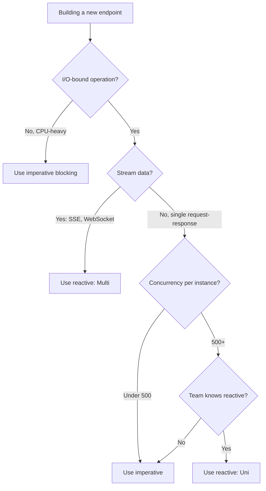

# Reactive Programming with Mutiny

`[Mid]`

Quarkus is built on a reactive core (Vert.x) but does not force you to write reactive code. The key is knowing when each model is appropriate.

## Mutiny Core Types

- **`Uni<T>`**: A lazy asynchronous action producing one item or a failure. Like `Mono` in Reactor or `CompletableFuture` in Java.
- **`Multi<T>`**: A stream of items. Like `Flux` in Reactor or a `Publisher`.

## When to Use Reactive vs Imperative



**Default to imperative.** For standard CRUD services, internal APIs, and most business logic, imperative with RESTEasy Reactive is simpler and fast enough.

**Use reactive when:** server-sent events, WebSocket, streaming large datasets, aggregating multiple downstream calls, or single-instance high concurrency.

## Uni Examples

### Single Async Operation

```java
@Path("/users")
@Produces(MediaType.APPLICATION_JSON)
public class UserResource {

    @Inject
    UserService userService;

    @GET
    @Path("/{id}")
    public Uni<User> getUser(@PathParam("id") Long id) {
        return userService.findById(id)
            .onItem().ifNull().failWith(() ->
                new NotFoundException("User not found: " + id));
    }

    @POST
    public Uni<Response> createUser(User user) {
        return userService.create(user)
            .onItem().transform(created ->
                Response.status(Response.Status.CREATED).entity(created).build());
    }
}
```

### Composing Multiple Async Calls

```java
public Uni<OrderSummary> getOrderSummary(Long orderId) {
    return Uni.combine().all()
        .unis(
            orderService.findById(orderId),
            paymentService.findByOrder(orderId),
            shippingService.findByOrder(orderId)
        )
        .asTuple()
        .onItem().transform(tuple ->
            new OrderSummary(
                tuple.getItem1(),
                tuple.getItem2(),
                tuple.getItem3()
            ));
}
```

### Error Handling

```java
return userService.findById(id)
    .onFailure(NotFoundException.class).recoverWithNull()
    .onFailure().recoverWithItem(fallbackUser);
```

## Multi Examples

### Server-Sent Events

```java
@Path("/events")
public class EventResource {

    @Inject
    EventService eventService;

    @GET
    @Path("/stream")
    @Produces(MediaType.SERVER_SENT_EVENTS)
    public Multi<String> streamEvents() {
        return eventService.eventStream()
            .onItem().transform(Event::toJson)
            .onFailure().recoverWithItem("{\"error\":\"stream-failure\"}");
    }
}
```

### Reactive Database Access

```java
@Path("/products")
@Produces(MediaType.APPLICATION_JSON)
public class ReactiveProductResource {

    @Inject
    io.vertx.mutiny.pgclient.PgPool client;

    @GET
    public Multi<Product> listAll() {
        return client.query("SELECT id, name, price FROM products")
            .execute()
            .onItem().transformToMulti(rowSet -> Multi.createFrom().iterable(rowSet))
            .onItem().transform(row -> new Product(
                row.getLong("id"),
                row.getString("name"),
                row.getBigDecimal("price")
            ));
    }
}
```

## Rules

- **Do not mix blocking calls inside reactive chains.** A blocking call on the event loop thread defeats the reactive model.
- **One paradigm per endpoint.** Pick imperative or reactive for each endpoint, do not blend them.
- **Mutiny is not Reactor.** Method names and composition patterns differ. Budget learning time if your team knows Reactor.

Previous: [Database Access](03-database.md) | Next: [Dependency Injection](05-dependency-injection.md)
