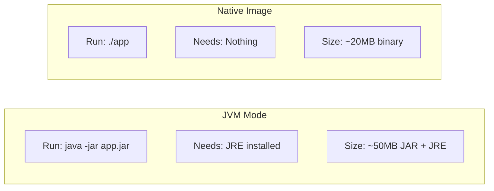

# GraalVM Native Image

``

Native image compilation makes Quarkus competitive with Go and Rust on cloud-native metrics. It compiles your Java application into a standalone native executable requiring no JVM.



## What You Get

| Metric | JVM Mode | Native Image |
|--------|----------|-------------|
| Startup | 0.5--1.5s | 10--30ms |
| Memory (idle) | 100--300 MB | 30--80 MB |
| First request | Includes JIT warm-up | Full speed immediately |
| Artifact | JAR + JVM runtime | Single binary (50--150 MB) |
| Docker image | 300--500 MB (JDK base) | 50--150 MB (distroless) |

## Step by Step

### 1. Build a Native Executable

```bash
# Local build (requires GraalVM installed)
mvn package -Dnative

# Container-based build (no local GraalVM needed)
mvn package -Dnative -Dquarkus.native.container-build=true

# Run it
./target/my-app-1.0.0-SNAPSHOT-runner
```

### 2. Verify the Startup

```bash
time ./target/my-app-1.0.0-SNAPSHOT-runner

# Output:
# __  ____  __  _____   ___  __ ____  ______
# Started in 0.018s
# real    0m0.023s
```

18 milliseconds to start. Compare with 1--2 seconds in JVM mode.

### 3. Handle Reflection

Native image performs closed-world analysis. Classes accessed only through reflection are excluded. Quarkus extensions handle most of this. For your own classes, use `@RegisterForReflection`:

```java
@RegisterForReflection
public class ProductDto {
    public String name;
    public BigDecimal price;
}
```

For third-party libraries without Quarkus extensions, provide configuration:

```json
// src/main/resources/META-INF/native-image/reflect-config.json
[
  {
    "name": "com.thirdparty.SomeDto",
    "allDeclaredConstructors": true,
    "allPublicMethods": true,
    "allDeclaredFields": true
  }
]
```

### 4. Test in Both Modes

```bash
# JVM mode tests
mvn test

# Native mode tests (builds native image, then runs tests against it)
mvn verify -Dnative
```

Always test in native mode. Reflection errors surface only at native build time.

## What It Costs

- **Build time:** 1--5 minutes. Significantly longer than JAR builds.
- **Reflection constraints:** Dynamic `Class.forName()`, runtime proxies, and bytecode generation require explicit registration.
- **Limited debugging:** Stack traces are less detailed. No remote debugger.
- **No runtime JIT:** All code compiled ahead of time. For I/O-bound microservices this is irrelevant.

## When Native vs JVM Mode

**Use native when:**
- Serverless platforms (AWS Lambda, Azure Functions, Google Cloud Run)
- Resource-constrained Kubernetes clusters
- Aggressive auto-scaling where cold starts impact users
- Fast scaling for traffic spikes

**Use JVM mode when:**
- Long-lived services where startup is irrelevant
- Heavy use of dynamic features (reflection-heavy libraries, runtime bytecode generation)
- Full debugging support needed in production
- CI build time is a bottleneck

## Mandrel

Mandrel is a GraalVM distribution maintained by Red Hat, optimized for Quarkus. It omits the polyglot runtime (JavaScript, Python, Ruby), making it smaller and faster for pure Java-to-native builds. Use Mandrel when you do not need GraalVM's polyglot features.

Previous: [Dependency Injection](../01-quarkus-core/05-dependency-injection.md) | Next: [Containerization](02-containerization.md)
