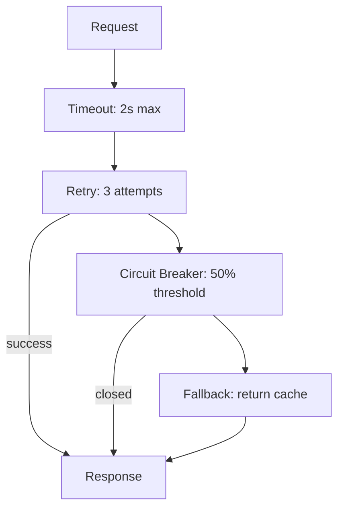

# Microservice Patterns with MicroProfile

`` ``

Quarkus implements MicroProfile specifications through SmallRye, providing fault tolerance, health checks, and metrics out of the box.

## Fault Tolerance

### Step 1: Add the Extension

```bash
mvn quarkus:add-extension -Dextensions="smallrye-fault-tolerance"
```

### Step 2: Apply Patterns

```java
@ApplicationScoped
public class PaymentClient {

    @Retry(maxRetries = 3, delay = 200, delayUnit = ChronoUnit.MILLIS)
    @CircuitBreaker(
        requestVolumeThreshold = 10,
        failureRatio = 0.5,
        delay = 5000,
        delayUnit = ChronoUnit.MILLIS
    )
    @Fallback(fallbackMethod = "fallbackPayment")
    @Timeout(3000)
    public PaymentResult processPayment(Order order) {
        return callPaymentGateway(order);
    }

    private PaymentResult fallbackPayment(Order order) {
        return new PaymentResult("PENDING", "Payment deferred, will retry");
    }
}
```

**Annotations explained:**
- `@Retry`: Retry up to 3 times with 200ms delay between attempts.
- `@CircuitBreaker`: Open the circuit after 10 calls with 50%+ failure rate. Stay open 5 seconds before half-open.
- `@Fallback`: Call `fallbackPayment` when all retries fail or circuit is open.
- `@Timeout`: Fail if the call exceeds 3 seconds.



### Step 3: Configure

```properties
# application.properties
# Global defaults
MicroProfile.Config.MP_Fault_Tolerance_Timeout_Enabled=true

# Per-method override
org.acme.PaymentClient/processPayment/Retry/maxRetries=5
org.acme.PaymentClient/processPayment/CircuitBreaker/delay=10000
```

## Health Checks

### Step 1: Add the Extension

```bash
mvn quarkus:add-extension -Dextensions="smallrye-health"
```

### Step 2: Implement Health Checks

```java
@Readiness
@ApplicationScoped
public class DatabaseHealthCheck implements HealthCheck {

    @Inject
    AgroalDataSource dataSource;

    @Override
    public HealthCheckResponse call() {
        try (Connection conn = dataSource.getConnection()) {
            boolean valid = conn.isValid(2);
            return HealthCheckResponse.named("database")
                .status(valid)
                .withData("connection", "ok")
                .build();
        } catch (SQLException e) {
            return HealthCheckResponse.named("database")
                .down()
                .withData("error", e.getMessage())
                .build();
        }
    }
}
```

### Step 3: Endpoints

Quarkus exposes health endpoints automatically:

```
GET /q/health/live    - Liveness: is the app running?
GET /q/health/ready   - Readiness: can it handle requests?
GET /q/health/started  - Startup: has initialization completed?
GET /q/health          - Aggregate of all checks
```

Kubernetes probes:

```yaml
livenessProbe:
  httpGet:
    path: /q/health/live
    port: 8080
readinessProbe:
  httpGet:
    path: /q/health/ready
    port: 8080
startupProbe:
  httpGet:
    path: /q/health/started
    port: 8080
```

## Metrics

### Step 1: Add Micrometer

```bash
mvn quarkus:add-extension -Dextensions="micrometer-registry-prometheus"
```

### Step 2: Record Custom Metrics

```java
@ApplicationScoped
public class OrderService {

    @Inject
    MeterRegistry registry;

    private Counter orderCounter;
    private Timer orderTimer;

    @PostConstruct
    void init() {
        orderCounter = Counter.builder("orders.created.total")
            .description("Total orders created")
            .tag("type", "standard")
            .register(registry);

        orderTimer = Timer.builder("orders.processing.duration")
            .description("Order processing time")
            .register(registry);
    }

    public Order createOrder(OrderRequest request) {
        return orderTimer.record(() -> {
            Order order = processOrder(request);
            orderCounter.increment();
            return order;
        });
    }
}
```

### Step 3: Scrape Endpoint

```
GET /q/metrics          - All metrics (Prometheus format)
GET /q/metrics/application  - Application metrics only
```

Previous: [Containerization](02-containerization.md) | Next: [Observability](04-observability.md)
