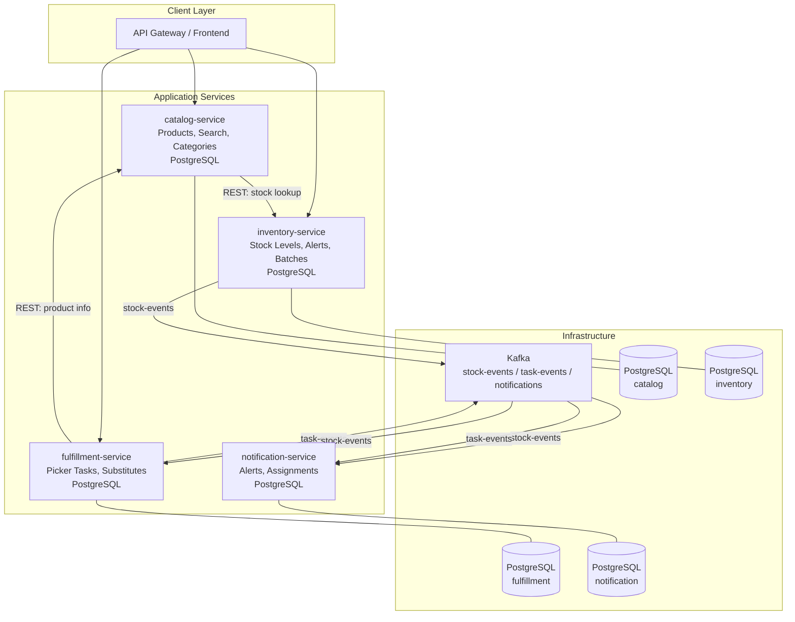

# Workshop: Online Grocery Fulfillment Platform

Build a cloud-native grocery fulfillment system with 4 Quarkus microservices, Kafka event streaming, and native image compilation.

**Challenge Repo:** https://github.com/TP-Coder-Innovation-Hub/Inventory-mgmt-system-challenge

---

## Business Context

An online grocery platform receives customer orders and fulfills them from warehouse zones. Pickers receive aisle-optimized task lists, scan items in real-time, and the system tracks stock levels, perishable batch expiry, and delivery readiness. The platform must handle concurrent orders without overselling and alert staff when stock runs low.

Key workflows:
- Customer places order with grocery items
- System allocates stock and generates picker tasks grouped by aisle/zone
- Picker collects items, marks substitutes when items are unavailable
- Low-stock alerts trigger restocking, notifications sent on task assignment and order completion

---

## Learning Objectives

| Topic | Applied In |
|---|---|
| Native image compilation | catalog-service, notification-service (< 100ms startup) |
| SmallRye Reactive Messaging | inventory-service (stock events), fulfillment-service (task events), notification-service (all alerts) |
| Panache ORM | All services — entity persistence with active record pattern |
| RESTEasy Reactive | All HTTP endpoints — non-blocking I/O |
| MicroProfile Health & Metrics | Liveness, readiness, startup probes + Prometheus metrics on every service |
| Hibernate Search | catalog-service full-text search on products |
| Optimistic locking | inventory-service concurrent stock decrement |
| Docker Compose | Local dev environment with PostgreSQL + Kafka |

---

## Architecture



### Communication Patterns

| From | To | Style | Channel |
|---|---|---|---|
| catalog-service | inventory-service | Sync REST | GET `/api/v1/inventory/{productId}/stock` |
| fulfillment-service | catalog-service | Sync REST | GET `/api/v1/products/{id}` |
| inventory-service | Kafka | Async publish | `stock-events` topic |
| fulfillment-service | Kafka | Async publish | `task-events` topic |
| Kafka → fulfillment-service | — | Async consume | `stock-events` topic |
| Kafka → notification-service | — | Async consume | `stock-events`, `task-events` topics |

---

## Feature Requirements

### 1. Product Catalog with Search

**Service:** catalog-service
**Database:** PostgreSQL with Hibernate Search (Elasticsearch integration)

Endpoints:
- `GET /api/v1/products` — paginated product list
- `GET /api/v1/products/{id}` — single product with category and pricing
- `GET /api/v1/products/search?q={query}&category={cat}` — full-text search
- `GET /api/v1/categories` — category tree

Acceptance criteria:
- [ ] Full-text search returns results within 200ms for 10k+ products
- [ ] Products have name, description, category, unit price, image URL, barcode
- [ ] Search supports filtering by category
- [ ] Hibernate Search index rebuilt on startup via config
- [ ] Panache entity with `Product` extending `PanacheEntity`
- [ ] RESTEasy Reactive endpoints return `Uni<Response>` where appropriate
- [ ] MicroProfile Health: liveness + readiness endpoints
- [ ] Compiles to native image, startup < 100ms

### 2. Real-time Inventory Management

**Service:** inventory-service
**Database:** PostgreSQL with optimistic locking

Endpoints:
- `GET /api/v1/inventory/{productId}/stock` — current stock per zone
- `POST /api/v1/inventory/decrement` — atomically decrement stock on order
- `GET /api/v1/inventory/low-stock` — items below reorder threshold
- `POST /api/v1/inventory/batches` — add perishable batch with expiry date
- `GET /api/v1/inventory/batches/expiring?days={n}` — batches expiring within N days

Kafka publishing:
- `stock-events` topic: `{ "eventType": "STOCK_LOW" | "STOCK_DECREMENTED", "productId", "warehouseZone", "quantity", "timestamp" }`

Acceptance criteria:
- [ ] Concurrent stock decrement uses `@Version` optimistic locking — returns 409 on conflict
- [ ] Low-stock threshold configurable via `application.properties`
- [ ] `STOCK_LOW` event published when stock drops below threshold
- [ ] `STOCK_DECREMENTED` event published on every decrement
- [ ] Perishable batches tracked with expiry dates, queryable by expiration window
- [ ] Stock tracked per warehouse zone (e.g., `PRODUCE-A1`, `DAIRY-B2`)
- [ ] SmallRye `@Incoming` / `@Outgoing` annotations for Kafka channels
- [ ] MicroProfile Health + Metrics endpoints

### 3. Picker Task Generation

**Service:** fulfillment-service
**Database:** PostgreSQL

Endpoints:
- `POST /api/v1/tasks` — generate picker tasks from order items
- `GET /api/v1/tasks/{id}` — task detail with items and zone
- `PUT /api/v1/tasks/{id}/pick` — mark item as picked (with optional substitute)
- `PUT /api/v1/tasks/{id}/complete` — complete the task
- `GET /api/v1/tasks?status={status}&pickerId={id}` — list tasks by status/picker

Kafka:
- Consumes `stock-events` to react to stock changes
- Publishes `task-events`: `{ "eventType": "TASK_CREATED" | "ITEM_PICKED" | "TASK_COMPLETED", "taskId", "pickerId", "orderId", "timestamp" }`

Acceptance criteria:
- [ ] Task generation groups items by warehouse zone/aisle for efficient picking route
- [ ] Each task item references a product with expected quantity
- [ ] Picker can mark an item as picked with a substitute product (triggers REST call to catalog-service for substitute validation)
- [ ] Stock allocation happens at pick time — calls inventory-service REST endpoint
- [ ] Task items ordered by zone sequence to minimize picker walking distance
- [ ] Consumes `stock-events` to invalidate pending tasks if stock becomes unavailable
- [ ] MicroProfile Health + Metrics endpoints

### 4. Notifications

**Service:** notification-service
**Database:** PostgreSQL (notification log)

Kafka consumption:
- `stock-events` → low-stock alert notifications
- `task-events` → task assignment and completion notifications

Endpoints:
- `GET /api/v1/notifications?type={type}&unread=true` — list notifications
- `PUT /api/v1/notifications/{id}/read` — mark as read

Acceptance criteria:
- [ ] Consumes both `stock-events` and `task-events` topics
- [ ] Generates three notification types: `LOW_STOCK`, `TASK_ASSIGNED`, `ORDER_PACKED`
- [ ] Notifications persisted to PostgreSQL with read/unread status
- [ ] Logs notification content to stdout (simulating push/email)
- [ ] Compiles to native image, startup < 100ms
- [ ] MicroProfile Health + Metrics endpoints

---

## Tech Constraints

| Constraint | Detail |
|---|---|
| Java version | 17+ |
| Quarkus version | 3.x |
| Build tool | Maven or Gradle |
| ORM | Panache (active record or repository pattern) |
| HTTP | RESTEasy Reactive only — no servlet-based REST |
| Messaging | SmallRye Reactive Messaging with Kafka connector |
| Health | MicroProfile Health (`@Liveness`, `@Readiness`, `@Startup`) |
| Metrics | Micrometer with Prometheus endpoint (`/q/metrics`) |
| Database | PostgreSQL per service, Flyway or Liquibase for migrations |
| Native image | At least catalog-service and notification-service must compile with `native-image` or `mandrel` |
| Containerization | Dockerfile per service (JVM + native variants) |
| Local dev | Single `docker-compose.yml` with all PostgreSQL instances + Kafka + Zookeeper |
| Tests | Unit tests with Quarkus Test, at least 1 integration test per service |

### Required `application.properties` Keys (per service)

```properties
quarkus.http.port=808X
quarkus.datasource.db-kind=postgresql
quarkus.datasource.jdbc.url=jdbc:postgresql://localhost:5432/{db}
quarkus.hibernate-orm.database.generation=validate
quarkus.hibernate-search-orm.elasticsearch.version=8
quarkus.smallrye-openapi.path=/openapi
quarkus.micrometer.export-prometheus.enabled=true
%dev.quarkus.live-reload.enabled=true
```

---

## Architecture Decision Records

### ADR-001: RESTEasy Reactive over Classic RESTEasy

**Context:** Quarkus offers both servlet-based and reactive HTTP runtimes.
**Decision:** Use RESTEasy Reactive for all endpoints.
**Rationale:** Unified IO thread model, lower memory footprint, better native image compatibility. RESTEasy Classic is deprecated in Quarkus 3.x.

### ADR-002: Kafka via SmallRye Reactive Messaging

**Context:** Services need async communication for stock events, task events, and notifications.
**Decision:** Use SmallRye Reactive Messaging with Kafka connector instead of plain Kafka client.
**Rationale:** Declarative `@Incoming`/`@Outgoing` model, backpressure support, consistent with reactive stack, easier testing with `InMemoryChannel`.

### ADR-003: Panache Active Record over Spring Data JPA

**Context:** Team needs a persistence abstraction.
**Decision:** Use Panache ORM active record pattern (`Entity extends PanacheEntity`).
**Rationale:** Less boilerplate than raw JPA, idiomatic Quarkus, works with native image out of the box, integrates with Hibernate Search.

### ADR-004: Optimistic Locking for Inventory Stock

**Context:** Multiple orders may decrement stock concurrently.
**Decision:** Use JPA `@Version` for optimistic locking on stock entities.
**Rationale:** Prevents overselling without distributed locks. Conflict returns 409 — caller retries. Adequate for grocery fulfillment throughput.

### ADR-005: Native Image for Low-Latency Services

**Context:** Some services must start fast in container environments.
**Decision:** Compile catalog-service and notification-service as native images. Remaining services run in JVM mode.
**Rationale:** Catalog faces direct user traffic (fast search response). Notification is event-driven and should scale to zero and back quickly. Fulfillment and inventory have complex JIT profiles better served by JVM warmup.

---

## Native vs JVM Performance Comparison

Include a benchmark in your README comparing both modes for at least catalog-service:

| Metric | JVM Mode | Native Image |
|---|---|---|
| Startup time | measure | must be < 100ms |
| First request latency | measure | measure |
| RSS memory (MB) | measure | measure |
| Throughput (req/s) on `/api/v1/products/search` | measure | measure |

Use `time curl` or a simple `wrk`/`hey` command. Document the command used.

---

## Submission Checklist

- [ ] All 4 services compile and start without errors
- [ ] `docker-compose up` starts PostgreSQL instances + Kafka + all services
- [ ] At least 2 services build as native images (`mvn package -Pnative`)
- [ ] Native vs JVM benchmark results in README
- [ ] Panache ORM used in all services
- [ ] SmallRye Reactive Messaging used for all Kafka communication
- [ ] RESTEasy Reactive used for all HTTP endpoints
- [ ] MicroProfile Health endpoints return 200 on `/q/health/live`, `/q/health/ready`
- [ ] Prometheus metrics available at `/q/metrics` on all services
- [ ] OpenAPI spec generated at `/openapi` on all services
- [ ] At least 1 integration test per service using `@QuarkusIntegrationTest`
- [ ] Flyway or Liquibase migrations for each database
- [ ] ADRs documented in `docs/adr/` or inline in README
- [ ] Code pushed to fork of the challenge repo
- [ ] README includes: architecture diagram, setup instructions, benchmark results
