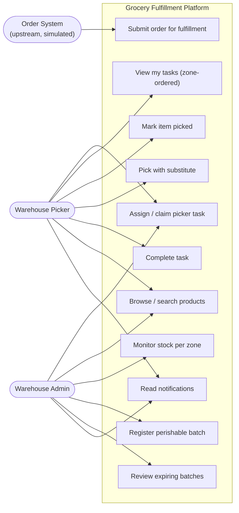
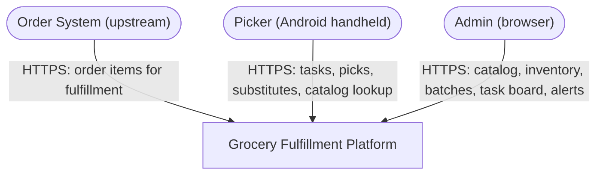
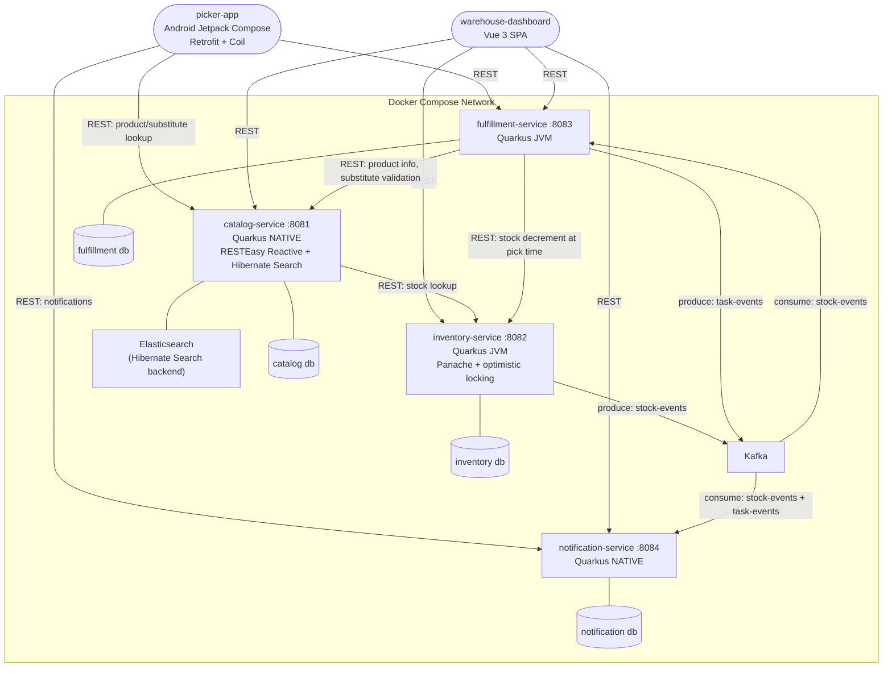
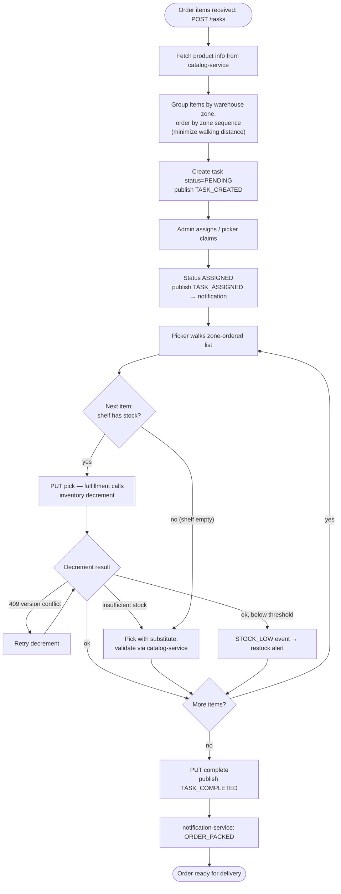
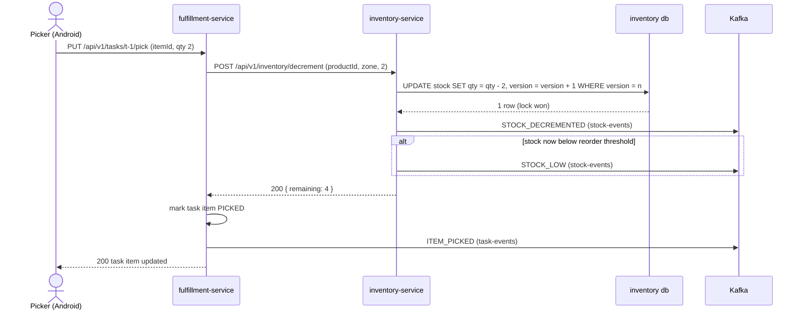
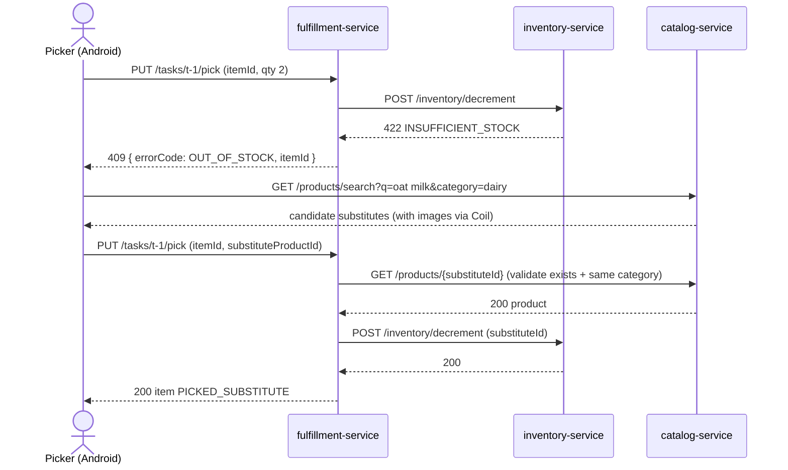
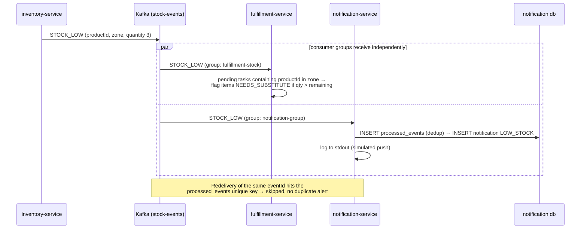

# Workshop Design: Online Grocery Fulfillment Platform

> Companion to [01-workshop-spec.md](./01-workshop-spec.md). Diagrams, contracts, schemas — code organization is the learner's call.

## Design Notes (read first)

1. **The system starts at task generation, not checkout.** The business context mentions "customer places order," but the spec's API surface begins at `POST /api/v1/tasks` with order items. Customer ordering/payment is out of scope — the order is an input payload, identified by an `orderId` you receive, not create. Don't build a cart.
2. **Assignment endpoint added.** The spec emits `TASK_ASSIGNED` notifications and filters tasks by `pickerId`, but defines no way to assign. This design adds `PUT /api/v1/tasks/{id}/assign`. Pickers are seeded staff records in fulfillment_db.
3. **Identity is a header, not a login.** No auth service exists in the 4-service architecture and auth is not a learning objective here. Clients send `X-Staff-Id` (picker or admin seed IDs); services trust it. State this simplification in your README — and note what you'd replace it with (OIDC) in production.
4. **Notification consumers deduplicate.** Kafka delivery is at-least-once; the spec doesn't mention dedup, but redelivered events must not create duplicate notifications. Same `processed_events` pattern as any serious consumer — it appears in the schema below.

---

## Part 1: High-Level Design

### 1.1 Use-Case Diagram



### 1.2 System Context Diagram



No outbound external systems — notifications log to stdout (simulating push/email) per the spec.

### 1.3 Container Diagram



No API gateway in this workshop (unlike a Spring Cloud stack) — clients address services by port; Docker Compose network is the boundary. All Kafka channels are SmallRye `@Incoming`/`@Outgoing`.

### 1.4 Activity Diagram — Order Fulfillment (primary business process)



### 1.5 Sequence Diagrams

#### 1.5.1 Happy path — pick an item (stock allocated at pick time)



#### 1.5.2 Error path — shelf empty, substitute flow



#### 1.5.3 Async path — STOCK_LOW fan-out



---

## Part 2: Frontend Design

### 2.1 Frontend Justification

| Frontend | Actor | Why |
|---|---|---|
| Android picker-app (Jetpack Compose, Material 3) | Picker | One-handed handheld use while pushing a cart: big tap targets, zone-ordered checklist, barcode-friendly. Product images via Coil from catalog `imageUrl` |
| Vue 3 warehouse-dashboard | Admin | Stock matrices, batch expiry tables, and a task board need a desktop |

The picker app talks to fulfillment, catalog (substitute search), and notification services directly (no gateway — see container diagram).

### 2.2 Screen Map (Android) and Route Map (Vue 3)

**Android — picker-app (Navigation Compose)**

| Screen | Purpose |
|---|---|
| `StaffSelectScreen` | Pick your staff identity (dev-mode login; sends `X-Staff-Id` thereafter) |
| `TaskListScreen` | My tasks (ASSIGNED/IN_PROGRESS) + claimable PENDING tasks; pull-to-refresh |
| `TaskDetailScreen` | Zone-ordered item checklist; progress bar (picked / total); complete button enabled only when all items resolved |
| `PickItemSheet` | Bottom sheet: confirm quantity → pick; on OUT_OF_STOCK shows substitute flow |
| `SubstituteSearchScreen` | Search catalog (debounced), filter same category, product cards with Coil images; select → pick-with-substitute |
| `NotificationsScreen` | TASK_ASSIGNED etc., unread badge, mark-as-read |

**Vue 3 — warehouse-dashboard**

| Route | Name | Purpose |
|---|---|---|
| `/staff` | StaffSelect | Choose admin identity (dev mode) |
| `/` | Overview | Low-stock alerts, expiring batches (7 days), tasks by status, unread notifications |
| `/products` | Catalog | Search/browse products (exercises Hibernate Search), category filter |
| `/inventory` | StockMatrix | Stock per product per zone; low-stock rows highlighted; threshold visible |
| `/inventory/batches` | Batches | Perishable batches; expiring-within-N-days filter; add-batch form |
| `/tasks` | TaskBoard | Kanban by status (PENDING → ASSIGNED → IN_PROGRESS → COMPLETED / INVALIDATED); assign action on PENDING |
| `/tasks/:id` | TaskDetail | Items, picks, substitutes, event timeline |
| `/notifications` | Notifications | Filterable log, mark-as-read |

### 2.3 Key UI Interactions

| Interaction | Behavior |
|---|---|
| Zone-ordered checklist | Items rendered in `zoneSequence` order — the UI *is* the picking route. Never re-sort client-side |
| Pick → conflict handling | `409 OUT_OF_STOCK` opens substitute flow; `409 CONCURRENT_MODIFICATION` (optimistic lock) auto-retries once, then surfaces "try again" |
| Substitute validation | Client suggests, server validates via catalog REST — picker can't pick a non-existent or wrong-category substitute |
| Task claim race | Two pickers claiming the same PENDING task: second gets `409 ALREADY_ASSIGNED`, list refreshes |
| Dashboard freshness | Poll overview every 15 s (no WebSocket/SSE in spec scope). Low-stock tiles deep-link to filtered StockMatrix |
| Notification badge | Android polls unread count on app foreground; mark-as-read is per item |
| Images | Coil with placeholder/error drawables — handheld networks are flaky; the list must not jump as images load |

---

## Part 3: API Contracts

Identity: `X-Staff-Id: <staff uuid>` on all requests (see Design Note 3). Errors: `{ "status": 422, "errorCode": "INSUFFICIENT_STOCK", "message": "...", "traceId": "..." }`

### catalog-service (:8081)

| | |
|---|---|
| `GET /api/v1/products?page=0&size=20&category=` | 200 `{ "content": [Product], page, size, totalElements }` — `Product`: `{ "id": number, "name": string, "description": string, "category": string, "unitPrice": "42.50", "imageUrl": string, "barcode": string }` |
| `GET /api/v1/products/{id}` | 200 Product · 404 `PRODUCT_NOT_FOUND` |
| `GET /api/v1/products/search?q=&category=` | 200 `[Product]` ranked by relevance (Hibernate Search; must return < 200 ms at 10k products) |
| `GET /api/v1/categories` | 200 `[ { "id": number, "name": string, "parentId": number \| null } ]` |

### inventory-service (:8082)

| | |
|---|---|
| `GET /api/v1/inventory/{productId}/stock` | 200 `{ "productId": number, "zones": [ { "warehouseZone": "PRODUCE-A1", "quantity": number, "reorderThreshold": number } ] }` |
| `POST /api/v1/inventory/decrement` — `{ "productId": number, "warehouseZone": string, "quantity": number, "reason": "PICK", "referenceId": string }` | 200 `{ "productId", "warehouseZone", "remaining": number }` · `422 INSUFFICIENT_STOCK` · `409 CONCURRENT_MODIFICATION` (optimistic lock — caller retries) · `404 STOCK_RECORD_NOT_FOUND` |
| `GET /api/v1/inventory/low-stock` | 200 `[ { "productId", "warehouseZone", "quantity", "reorderThreshold" } ]` |
| `POST /api/v1/inventory/batches` — `{ "productId": number, "warehouseZone": string, "quantity": number, "expiryDate": date, "batchCode": string }` | 201 Batch · `422` (past expiry date) |
| `GET /api/v1/inventory/batches/expiring?days=7` | 200 `[Batch]` ordered by expiryDate ascending |

### fulfillment-service (:8083)

| | |
|---|---|
| `POST /api/v1/tasks` — `{ "orderId": string, "items": [ { "productId": number, "quantity": number } ] }` | 201 Task (items grouped + ordered by zone sequence) · `422 UNKNOWN_PRODUCT` (catalog lookup failed) · `503 CATALOG_UNAVAILABLE` |
| `PUT /api/v1/tasks/{id}/assign` — `{ "pickerId": uuid }` | 200 Task (status ASSIGNED, publishes TASK_ASSIGNED via task-events) · `409 ALREADY_ASSIGNED` · `404` |
| `GET /api/v1/tasks/{id}` | 200 `{ "id": uuid, "orderId": string, "pickerId": uuid \| null, "status": "PENDING" \| "ASSIGNED" \| "IN_PROGRESS" \| "COMPLETED" \| "INVALIDATED", "items": [ { "id": uuid, "productId": number, "productName": string, "imageUrl": string, "warehouseZone": string, "zoneSequence": number, "expectedQty": number, "status": "PENDING" \| "PICKED" \| "PICKED_SUBSTITUTE" \| "NEEDS_SUBSTITUTE", "substituteProductId": number \| null } ] }` |
| `PUT /api/v1/tasks/{id}/pick` — `{ "itemId": uuid, "quantity": number, "substituteProductId": number \| null }` | 200 updated item (decrements inventory; publishes ITEM_PICKED) · `409 OUT_OF_STOCK` (triggers substitute flow) · `422 INVALID_SUBSTITUTE` (catalog rejected) · `404` |
| `PUT /api/v1/tasks/{id}/complete` | 200 Task COMPLETED (publishes TASK_COMPLETED) · `422 UNRESOLVED_ITEMS` (items still PENDING/NEEDS_SUBSTITUTE) |
| `GET /api/v1/tasks?status=&pickerId=&page=0&size=20` | 200 paginated tasks |

### notification-service (:8084)

| | |
|---|---|
| `GET /api/v1/notifications?type=&unread=true&staffId=&page=0&size=20` | 200 `{ "content": [ { "id": uuid, "type": "LOW_STOCK" \| "TASK_ASSIGNED" \| "ORDER_PACKED", "title": string, "body": string, "read": boolean, "createdAt": iso8601 } ], ... }` |
| `PUT /api/v1/notifications/{id}/read` | 200 notification · `404` |

All services additionally expose `/q/health/live`, `/q/health/ready`, `/q/metrics`, `/openapi` (MicroProfile/Quarkus conventions).

---

## Part 4: Database Schema

Panache active record maps cleanly to these tables; `bigserial` IDs match `PanacheEntity`'s `Long id` (the spec mandates `extends PanacheEntity`). Migrations: Flyway, one `db/migration` per service.

### catalog db

```sql
CREATE TABLE categories (
    id        BIGSERIAL PRIMARY KEY,
    name      VARCHAR(64) NOT NULL UNIQUE,
    parent_id BIGINT REFERENCES categories(id)
);

CREATE TABLE products (
    id          BIGSERIAL PRIMARY KEY,
    name        VARCHAR(128)  NOT NULL,
    description TEXT,
    category_id BIGINT        NOT NULL REFERENCES categories(id),
    unit_price  NUMERIC(10,2) NOT NULL CHECK (unit_price >= 0),
    image_url   VARCHAR(512),
    barcode     VARCHAR(32) UNIQUE,
    created_at  TIMESTAMPTZ NOT NULL DEFAULT now()
);

CREATE INDEX idx_products_category ON products (category_id);
-- Full-text search lives in Elasticsearch via Hibernate Search (@Indexed on the
-- entity, index rebuilt on startup) — no Postgres text index needed.
```

### inventory db

```sql
CREATE TABLE stock_levels (
    id                BIGSERIAL PRIMARY KEY,
    product_id        BIGINT      NOT NULL,         -- catalog id; no FK across services
    warehouse_zone    VARCHAR(32) NOT NULL,         -- e.g. PRODUCE-A1, DAIRY-B2
    quantity          INT         NOT NULL CHECK (quantity >= 0),
    reorder_threshold INT         NOT NULL DEFAULT 10,
    version           BIGINT      NOT NULL DEFAULT 0,  -- optimistic lock (ADR-004)
    UNIQUE (product_id, warehouse_zone)
);

CREATE TABLE perishable_batches (
    id             BIGSERIAL PRIMARY KEY,
    product_id     BIGINT      NOT NULL,
    warehouse_zone VARCHAR(32) NOT NULL,
    quantity       INT         NOT NULL CHECK (quantity >= 0),
    expiry_date    DATE        NOT NULL,
    batch_code     VARCHAR(64) NOT NULL UNIQUE,
    created_at     TIMESTAMPTZ NOT NULL DEFAULT now()
);

CREATE INDEX idx_batches_expiry ON perishable_batches (expiry_date);

CREATE TABLE outbox_events (             -- atomic decrement + event publication
    event_id     UUID        PRIMARY KEY DEFAULT gen_random_uuid(),
    aggregate_id BIGINT      NOT NULL,   -- product_id (Kafka key source)
    event_type   VARCHAR(32) NOT NULL,
    payload      JSONB       NOT NULL,
    published    BOOLEAN     NOT NULL DEFAULT false,
    created_at   TIMESTAMPTZ NOT NULL DEFAULT now()
);
CREATE INDEX idx_outbox_unpublished ON outbox_events (created_at) WHERE NOT published;
```

### fulfillment db

```sql
CREATE TABLE pickers (
    id        UUID PRIMARY KEY DEFAULT gen_random_uuid(),
    name      VARCHAR(64) NOT NULL,
    role      VARCHAR(16) NOT NULL DEFAULT 'PICKER' CHECK (role IN ('PICKER','ADMIN')),
    active    BOOLEAN NOT NULL DEFAULT true
);

CREATE TABLE picker_tasks (
    id         UUID PRIMARY KEY DEFAULT gen_random_uuid(),
    order_id   VARCHAR(64) NOT NULL,
    picker_id  UUID REFERENCES pickers(id),
    status     VARCHAR(16) NOT NULL DEFAULT 'PENDING'
               CHECK (status IN ('PENDING','ASSIGNED','IN_PROGRESS','COMPLETED','INVALIDATED')),
    created_at   TIMESTAMPTZ NOT NULL DEFAULT now(),
    completed_at TIMESTAMPTZ
);

CREATE INDEX idx_tasks_picker_status ON picker_tasks (picker_id, status);
CREATE INDEX idx_tasks_status ON picker_tasks (status, created_at);

CREATE TABLE task_items (
    id                    UUID PRIMARY KEY DEFAULT gen_random_uuid(),
    task_id               UUID NOT NULL REFERENCES picker_tasks(id) ON DELETE CASCADE,
    product_id            BIGINT       NOT NULL,
    product_name          VARCHAR(128) NOT NULL,  -- denormalized snapshot from catalog at
    image_url             VARCHAR(512),           -- task creation: tasks must survive
    warehouse_zone        VARCHAR(32)  NOT NULL,  -- catalog edits/outages mid-pick
    zone_sequence         INT          NOT NULL,  -- picking route order
    expected_qty          INT          NOT NULL CHECK (expected_qty > 0),
    status                VARCHAR(20)  NOT NULL DEFAULT 'PENDING'
                          CHECK (status IN ('PENDING','PICKED','PICKED_SUBSTITUTE','NEEDS_SUBSTITUTE')),
    substitute_product_id BIGINT,
    picked_at             TIMESTAMPTZ
);

CREATE INDEX idx_task_items_task ON task_items (task_id, zone_sequence);
-- zone_sequence drives the walking route; pending-task invalidation on STOCK_LOW
-- queries (product_id, status):
CREATE INDEX idx_task_items_product_status ON task_items (product_id, status);
```

### notification db

```sql
CREATE TABLE processed_events (         -- consumer idempotency (Design Note 4)
    event_id     UUID PRIMARY KEY,
    processed_at TIMESTAMPTZ NOT NULL DEFAULT now()
);

CREATE TABLE notifications (
    id         UUID PRIMARY KEY DEFAULT gen_random_uuid(),
    event_id   UUID         NOT NULL,
    type       VARCHAR(16)  NOT NULL CHECK (type IN ('LOW_STOCK','TASK_ASSIGNED','ORDER_PACKED')),
    staff_id   UUID,                    -- NULL for broadcast (LOW_STOCK)
    title      VARCHAR(128) NOT NULL,
    body       TEXT         NOT NULL,
    read       BOOLEAN      NOT NULL DEFAULT false,
    created_at TIMESTAMPTZ  NOT NULL DEFAULT now()
);

CREATE INDEX idx_notifications_staff_unread ON notifications (staff_id, read, created_at DESC);
CREATE INDEX idx_notifications_type ON notifications (type, created_at DESC);
```

---

## Part 5: Event Contracts

Envelope (all topics): `{ "eventId": uuid, "eventType": string, "timestamp": iso8601, "payload": {} }`. Both topics keyed for per-aggregate ordering; delivery at-least-once (outbox on the producer, `processed_events` dedup on consumers).

| Topic | Producer → Consumers | Key | Events |
|---|---|---|---|
| `stock-events` | inventory-service → fulfillment-service (`fulfillment-stock` group), notification-service (`notification-group`) | `productId` | `STOCK_DECREMENTED`, `STOCK_LOW` |
| `task-events` | fulfillment-service → notification-service (`notification-group`) | `taskId` | `TASK_CREATED`, `TASK_ASSIGNED`, `ITEM_PICKED`, `TASK_COMPLETED` |

### Payloads

```json
// STOCK_DECREMENTED / STOCK_LOW (stock-events)
{ "productId": 42, "warehouseZone": "DAIRY-B2", "quantity": 3,
  "reorderThreshold": 10, "reason": "PICK", "referenceId": "t-uuid" }

// TASK_CREATED / TASK_ASSIGNED / ITEM_PICKED / TASK_COMPLETED (task-events)
{ "taskId": "uuid", "orderId": "ord-2026-0001", "pickerId": "uuid-or-null",
  "itemId": "uuid-or-null", "productId": 42 }
```

### Consumer behavior contracts

- **fulfillment-service ← stock-events**: on `STOCK_LOW`, flag matching PENDING/ASSIGNED task items `NEEDS_SUBSTITUTE` when `expected_qty > quantity`; ignores `STOCK_DECREMENTED` it caused itself (compare `referenceId` to own task IDs).
- **notification-service ← both topics**: `STOCK_LOW` → broadcast `LOW_STOCK` notification (staff_id NULL); `TASK_ASSIGNED` → notification for that `pickerId`; `TASK_COMPLETED` → `ORDER_PACKED` broadcast; every consumed event logged to stdout (simulated push). Dedup via `processed_events` insert-first.

---

## Part 6: Seed Data

```sql
-- catalog db ------------------------------------------------------------
INSERT INTO categories (id, name, parent_id) VALUES
(1, 'Produce', NULL), (2, 'Dairy', NULL), (3, 'Pantry', NULL), (4, 'Milk', 2);

INSERT INTO products (id, name, description, category_id, unit_price, image_url, barcode) VALUES
(1, 'Jasmine Rice 5kg',      'Thai hom mali rice',            3, 295.00, 'https://img.test/rice.jpg',   '8850001000011'),
(2, 'Fish Sauce 700ml',      'Premium grade fish sauce',      3,  52.00, 'https://img.test/nampla.jpg', '8850001000028'),
(3, 'Fresh Milk 2L',         'Pasteurized whole milk',        4,  92.00, 'https://img.test/milk.jpg',   '8850001000035'),
(4, 'Oat Milk 1L',           'Plant-based milk alternative',  4,  79.00, 'https://img.test/oat.jpg',    '8850001000042'),
(5, 'Holy Basil 100g',       'Fresh kaprao leaves',           1,  15.00, 'https://img.test/basil.jpg',  '8850001000059'),
(6, 'Bird''s Eye Chili 100g','Fresh prik kee noo',            1,  18.00, 'https://img.test/chili.jpg',  '8850001000066'),
(7, 'Greek Yogurt 500g',     'Plain, unsweetened',            2, 119.00, 'https://img.test/yogurt.jpg', '8850001000073');
-- Products 3 & 4 are same-category substitutes (the substitute-flow test pair).

-- inventory db ----------------------------------------------------------
INSERT INTO stock_levels (product_id, warehouse_zone, quantity, reorder_threshold) VALUES
(1, 'PANTRY-C1', 120, 20),
(2, 'PANTRY-C2',  45, 15),
(3, 'DAIRY-B2',    3, 10),   -- BELOW threshold: appears in /low-stock, fires STOCK_LOW on next decrement
(4, 'DAIRY-B2',   30, 10),
(5, 'PRODUCE-A1', 60, 25),
(6, 'PRODUCE-A1',  0, 25),   -- ZERO stock: pick must 409 OUT_OF_STOCK → substitute flow
(7, 'DAIRY-B1',   25, 10);

INSERT INTO perishable_batches (product_id, warehouse_zone, quantity, expiry_date, batch_code) VALUES
(3, 'DAIRY-B2',   3, CURRENT_DATE + 2,  'MILK-2026-0612'),   -- expiring within default 7-day window
(7, 'DAIRY-B1',  25, CURRENT_DATE + 14, 'YOG-2026-0610'),
(5, 'PRODUCE-A1',60, CURRENT_DATE + 1,  'BASIL-2026-0611');  -- expires tomorrow: top of expiring list

-- fulfillment db ----------------------------------------------------------
INSERT INTO pickers (id, name, role) VALUES
('77770001-0000-0000-0000-000000000001', 'Somchai',  'PICKER'),
('77770001-0000-0000-0000-000000000002', 'Malee',    'PICKER'),
('77770001-0000-0000-0000-000000000003', 'Apinya',   'ADMIN');

INSERT INTO picker_tasks (id, order_id, picker_id, status, created_at) VALUES
('88880001-0000-0000-0000-000000000001', 'ord-2026-0001', '77770001-0000-0000-0000-000000000001', 'ASSIGNED', now() - interval '20 minutes'),
('88880001-0000-0000-0000-000000000002', 'ord-2026-0002', NULL, 'PENDING', now() - interval '5 minutes'),  -- claimable; claim-race test
('88880001-0000-0000-0000-000000000003', 'ord-2026-0003', '77770001-0000-0000-0000-000000000002', 'COMPLETED', now() - interval '2 hours');

-- Task 1 items: zone_sequence proves route ordering (PRODUCE before DAIRY before PANTRY)
INSERT INTO task_items (task_id, product_id, product_name, image_url, warehouse_zone, zone_sequence, expected_qty, status) VALUES
('88880001-0000-0000-0000-000000000001', 5, 'Holy Basil 100g',  'https://img.test/basil.jpg', 'PRODUCE-A1', 1, 2, 'PICKED'),
('88880001-0000-0000-0000-000000000001', 6, 'Bird''s Eye Chili 100g', 'https://img.test/chili.jpg', 'PRODUCE-A1', 2, 1, 'NEEDS_SUBSTITUTE'), -- zero stock
('88880001-0000-0000-0000-000000000001', 3, 'Fresh Milk 2L',    'https://img.test/milk.jpg',  'DAIRY-B2',   3, 2, 'PENDING'),
('88880001-0000-0000-0000-000000000001', 1, 'Jasmine Rice 5kg', 'https://img.test/rice.jpg',  'PANTRY-C1',  4, 1, 'PENDING');

-- notification db ---------------------------------------------------------
INSERT INTO processed_events (event_id) VALUES ('99990001-0000-0000-0000-000000000001');

INSERT INTO notifications (event_id, type, staff_id, title, body, read, created_at) VALUES
('99990001-0000-0000-0000-000000000001', 'TASK_ASSIGNED', '77770001-0000-0000-0000-000000000001',
 'New picking task', 'Task for order ord-2026-0001 assigned to you (4 items, 3 zones)', false, now() - interval '20 minutes'),
('99990001-0000-0000-0000-000000000002', 'LOW_STOCK', NULL,
 'Low stock: Fresh Milk 2L', 'DAIRY-B2 has 3 units (threshold 10) — restock needed', false, now() - interval '15 minutes'),
('99990001-0000-0000-0000-000000000003', 'ORDER_PACKED', NULL,
 'Order ord-2026-0003 packed', 'Completed by Malee', true, now() - interval '2 hours');
```

| Seeded scenario | What it exercises |
|---|---|
| Milk at 3/10 in DAIRY-B2 | `/low-stock`, STOCK_LOW on next decrement, dashboard alert tile |
| Chili at 0 stock | 409 OUT_OF_STOCK → substitute search → pick-with-substitute (milk/oat-milk pair for category validation) |
| Task 1 with 4 items across 3 zones | zone_sequence route ordering on the Android checklist |
| Unassigned PENDING task | Claim flow + `409 ALREADY_ASSIGNED` race |
| Basil batch expiring tomorrow | `/batches/expiring?days=7` ordering |
| 3 notification types, mixed read state | Notification list filters, unread badge, mark-as-read |
| 3 staff incl. ADMIN | `X-Staff-Id` identity for both frontends |
