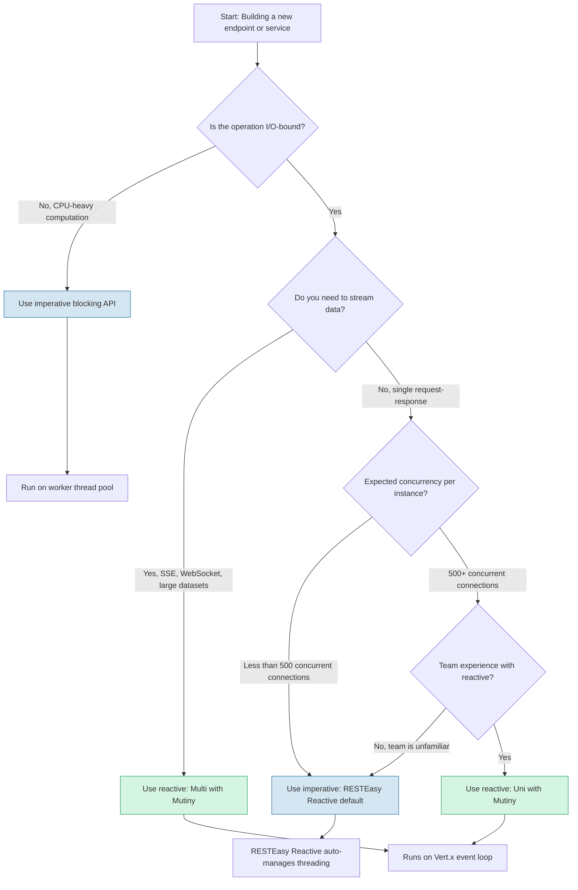

# Quarkus Cloud-Native Java Fundamentals

> A hands-on learning path for Java developers building cloud-native applications with Quarkus 3.x, GraalVM/Mandrel native compilation, and reactive programming.

---

## Table of Contents

1. [Why Cloud-Native Java in 2026](#1-why-cloud-native-java-in-2026)
2. [The Quarkus Mental Model: Build-Time vs Runtime](#2-the-quarkus-mental-model-build-time-vs-runtime)
3. [Dev Mode: The Developer Experience](#3-dev-mode-the-developer-experience)
4. [Reactive and Imperative: Both First-Class](#4-reactive-and-imperative-both-first-class)
5. [Native Compilation and GraalVM](#5-native-compilation-and-graalvm)
6. [Framework Landscape](#6-framework-landscape)
7. [Decision Framework: When Quarkus vs Spring Boot](#7-decision-framework-when-quarkus-vs-spring-boot)
8. [Common Pitfalls](#8-common-pitfalls)
9. [What's Next](#9-whats-next)

---

## 1. Why Cloud-Native Java in 2026

`[Entry]` `[Mid]`

Java has been the backbone of enterprise software for over two decades. Its strength -- a mature ecosystem, robust type system, and battle-tested JVM -- made it the default choice for backend services, monoliths, and large-scale enterprise applications. But the infrastructure landscape shifted underneath it.

### The Problem: JVM in the Cloud

Cloud-native infrastructure -- Kubernetes, serverless platforms, auto-scaling groups -- demands something the traditional JVM was never designed for: fast startup and low memory at rest.

Consider a typical Spring Boot application starting up in a Kubernetes pod:

- **Startup time:** 2--5 seconds on a warm JVM, 10--15 seconds with classpath scanning and bean initialization on a larger application.
- **Memory footprint:** 200--500 MB RSS for a service doing almost nothing at runtime, because the JVM loads an entire garbage-collected heap, JIT compiler, and class metadata.
- **Scaling latency:** When horizontal pod autoscaler fires, each new pod pays that startup cost. Users feel it as increased latency or timeouts.

This matters because cloud platforms bill by memory-seconds and CPU-seconds. A service that idles at 300 MB but only serves 10 requests per minute is wasting money. A service that takes 12 seconds to start cannot respond to a traffic spike in time.

The JVM's design assumptions -- long-running processes, warm-up periods for JIT optimization, generous heap allocation -- are fundamentally at odds with ephemeral, auto-scaling container workloads.

### Why Java Needs to Adapt

Languages like Go and Rust start in milliseconds and consume tens of megabytes. They became the default for cloud-native infrastructure tooling, CLI tools, and microservices where resource efficiency matters. The message was clear: if Java wanted to remain relevant in cloud deployments, it had to change.

The Java ecosystem responded with several approaches:

- **GraalVM native image** compiles Java bytecode ahead-of-time into a standalone native executable. No JVM startup, no JIT warm-up, no classpath scanning at runtime.
- **Build-time processing** moves framework work (annotation scanning, bean discovery, configuration resolution) from application startup to the build phase. The running application starts with a pre-computed model of itself.
- **Reactive runtimes** replace thread-per-request models with event-loop architectures that handle more concurrency with fewer threads and less memory.

### Quarkus's Answer

Quarkus, developed by Red Hat, combines all three approaches into a unified framework:

1. **Build-time processing** of annotations, dependency injection metadata, and configuration. What traditionally happened at startup now happens during `mvn package` or `gradle build`.
2. **First-class GraalVM native image support** with extensions that handle reflection registration, resource inclusion, and native substitution automatically.
3. **A reactive core** built on Vert.x and Eclipse Mutiny, while keeping imperative (blocking) APIs fully supported and idiomatic.

The result: a Quarkus application in JVM mode starts in roughly 0.5--1 second. In native mode, it starts in 10--30 milliseconds. Memory footprint drops to 30--80 MB RSS for typical microservices.

This is not a marginal improvement. It is a category change. It moves Java from "too heavy for serverless" to "competitive with Go" on cloud-native infrastructure metrics.

---

## 2. The Quarkus Mental Model: Build-Time vs Runtime

`[Entry]`

The single most important concept to understand about Quarkus is the separation of build-time work from runtime work. Everything else follows from this.

In a traditional Java framework (Spring, Jakarta EE), the application JAR or WAR contains metadata -- annotations, XML descriptors, property files -- that must be interpreted, scanned, and resolved every time the application starts. The framework performs this work at runtime, in every deployment, on every restart.

Quarkus moves the vast majority of this work to the build phase.

### What Moves to Build Time

- **Annotation processing:** `@Path`, `@GET`, `@Inject`, `@ConfigProperty` -- all scanned and registered during the build. The running application never re-scans annotations.
- **Bean discovery and dependency injection wiring:** The CDI bean graph is computed during the build. At runtime, the container simply instantiates pre-resolved beans.
- **Configuration resolution:** Static configuration properties are baked into the application. Only runtime-overridable properties (environment variables, system properties) are resolved at startup.
- **Extension metadata processing:** Each Quarkus extension registers its capabilities (REST endpoints, datasource providers, serialization modules) during the build. The runtime only loads what was resolved.
- **Reflective metadata registration for native images:** When building a native executable, Quarkus extensions automatically register the classes, methods, and resources that GraalVM needs to include.

### What Stays at Runtime

- **Request handling:** Processing HTTP requests, executing business logic, database queries.
- **Runtime configuration overrides:** Environment variables, Kubernetes ConfigMaps, system properties that override build-time defaults.
- **Connection pool initialization:** Database connections, HTTP client pools, messaging connections.
- **Application state:** In-memory caches, session state, mutable application data.

### The Build-Time Optimization Pipeline

The following diagram illustrates how Quarkus shifts framework work from runtime to build time, compared to a traditional Java framework:

```mermaid
flowchart LR
    subgraph Traditional["Traditional Framework"]
        direction TB
        T1["Source Code"] --> T2["Compile to Bytecode"]
        T2 --> T3["Package JAR"]
        T3 --> T4["Deploy to Container"]
        T4 --> T5["Runtime: Classpath Scanning"]
        T5 --> T6["Runtime: Bean Discovery"]
        T6 --> T7["Runtime: Annotation Processing"]
        T7 --> T8["Runtime: Config Resolution"]
        T8 --> T9["Runtime: DI Wiring"]
        T9 --> T10["Application Ready"]
    end

    subgraph Quarkus["Quarkus"]
        direction TB
        Q1["Source Code"] --> Q2["Compile to Bytecode"]
        Q2 --> Q3["Build-Time: Annotation Processing"]
        Q3 --> Q4["Build-Time: Bean Discovery"]
        Q4 --> Q5["Build-Time: Config Resolution"]
        Q5 --> Q6["Build-Time: DI Wiring"]
        Q6 --> Q7["Build-Time: Metadata Generation"]
        Q7 --> Q8["Package Optimized JAR / Native Image"]
        Q8 --> Q9["Deploy to Container"]
        Q9 --> Q10["Runtime: Instantiate Pre-Resolved Beans"]
        Q10 --> Q11["Application Ready"]
    end

    style Traditional fill:#f5e6e6,stroke:#cc3333,color:#333
    style Quarkus fill:#e6f0e6,stroke:#33aa33,color:#333
```



### What This Means in Practice

When you run `mvn quarkus:dev`, the build-time steps execute once. Live reload only re-executes the build-time pipeline for the changed classes, not the entire application. When you build a native image with `mvn package -Dnative`, the build-time pipeline runs once and the resulting binary contains only the runtime code paths that are actually used.

This architectural choice has a cascading effect:

- **Startup is fast** because there is almost no framework initialization work to do.
- **Memory is low** because there is no classpath scanning metadata, no annotation reflection caches, no dynamically generated proxy classes stored in memory.
- **Native compilation is reliable** because extensions have already determined which classes and methods need reflection access, rather than relying on runtime reflection analysis.

### A Concrete Example

Consider a simple REST endpoint:

```java
@Path("/hello")
public class GreetingResource {

    @Inject
    GreetingService service;

    @GET
    @Produces(MediaType.TEXT_PLAIN)
    public String hello() {
        return service.greet();
    }
}
```

In a traditional framework, at startup time the framework would:
1. Scan the classpath for classes annotated with `@Path`.
2. Reflect on `GreetingResource` to find `@GET` methods.
3. Scan for `@Inject` fields and resolve `GreetingService` from the bean registry.
4. Build internal routing tables and dependency graphs.
5. Finally, the endpoint is ready.

In Quarkus, steps 1--4 happen during `mvn compile`. The generated output includes pre-computed routing metadata and a pre-resolved dependency graph. At runtime, the framework instantiates `GreetingResource` and `GreetingService` and registers the route. The work is minimal.

---

## 3. Dev Mode: The Developer Experience

`[Entry]`

Quarkus provides a development mode (`mvn quarkus:dev` or `gradle quarkusDev`) that fundamentally changes how Java developers work. It is not hot-redeploy bolted onto a framework. It is a continuous build-and-reload loop integrated with the build-time processing pipeline.

### Live Reload

When you modify a source file and save it, Quarkus:

1. Compiles the changed file.
2. Re-runs the build-time processing pipeline for affected classes (annotation processing, bean wiring, route registration).
3. Hot-replaces the changed classes in the running JVM.
4. The application is ready within milliseconds -- typically under 100ms for a single file change.

This works for:
- Adding new REST endpoints.
- Changing `@ConfigProperty` values in `application.properties`.
- Adding or removing CDI beans and `@Inject` points.
- Modifying JPA entity mappings.

It does **not** require a full application restart. It does not require a separate build tool invocation. You save the file, and the running application reflects the change almost immediately.

### Continuous Testing

In dev mode, Quarkus runs tests continuously in the background. When you change a source file:

1. Affected tests are identified.
2. Tests execute against the running application.
3. Results appear in the console and in the Dev UI.

This provides near-instant feedback. You write a test, save it, and see the result without manually triggering a test run. It changes the development rhythm from "code, build, test, deploy" to "code and see results."

### Dev Services

Dev Services is Quarkus's automatic container provisioning for development. When you configure a Quarkus extension that requires an external service (PostgreSQL, Kafka, Redis, MongoDB, Keycloak, and many others), and you run in dev mode without configuring a connection URL, Quarkus automatically:

1. Starts a Docker or Podman container with the required service.
2. Configures the application to connect to it.
3. Stops the container when dev mode exits.

Example: If you add the `quarkus-agroal` and `quarkus-hibernate-orm` extensions with a PostgreSQL JDBC driver, running `mvn quarkus:dev` with no datasource configuration will start a PostgreSQL container and wire the application to it. No Docker Compose file needed. No manual setup.

```properties
# application.properties -- no datasource URL needed in dev mode
# Quarkus Dev Services starts PostgreSQL automatically
quarkus.hibernate-orm.database.generation=drop-and-create
```

This eliminates an entire class of "works on my machine" problems. Every developer on the team gets the same database, same schema, same messaging infrastructure, automatically.

### How This Differs from Traditional Java Development

| Aspect | Traditional (Spring Boot) | Quarkus Dev Mode |
|---|---|---|
| Code change to feedback | 5--30 seconds (rebuild + restart) | Under 1 second (live reload) |
| Test execution | Manual (`mvn test`) | Continuous (automatic on save) |
| External services | Docker Compose or manual setup | Automatic (Dev Services) |
| Configuration changes | Restart required | Live reload |
| Bean wiring changes | Restart required | Live reload |

The productivity impact is significant. Developers spend less time waiting for restarts and more time writing and validating code.

---

## 4. Reactive and Imperative: Both First-Class

`[Mid]`

Quarkus is built on a reactive core (Vert.x), but it does not force you to write reactive code. Imperative, blocking APIs are fully supported and are the default for most use cases. The key is understanding when each model is appropriate.

### Imperative: JAX-RS with RESTEasy Reactive

RESTEasy Reactive is Quarkus's default REST implementation since Quarkus 3.x. It provides standard JAX-RS annotations (`@Path`, `@GET`, `@POST`) with an implementation that uses Vert.x under the hood but allows blocking operations on dedicated worker threads.

```java
@Path("/users")
public class UserResource {

    @Inject
    UserRepository repository;

    @GET
    @Path("/{id}")
    @Produces(MediaType.APPLICATION_JSON)
    public User getUser(@PathParam("id") Long id) {
        return repository.findById(id);
    }

    @POST
    @Consumes(MediaType.APPLICATION_JSON)
    @Produces(MediaType.APPLICATION_JSON)
    public Response createUser(User user) {
        repository.persist(user);
        return Response.status(Response.Status.CREATED).entity(user).build();
    }
}
```

This looks like standard JAX-RS. The method blocks on the database call, and Quarkus handles the threading automatically. For most CRUD services, this is all you need.

### Reactive: Mutiny and Vert.x

When you need to handle high concurrency, stream data, or compose asynchronous operations, Quarkus provides Eclipse Mutiny as its primary reactive programming library. Mutiny uses an event-driven model with two core types:

- `Multi<T>`: A stream of items (analogous to `Flux` in Reactor).
- `Uni<T>`: A lazy asynchronous action that produces either one item or a failure (analogous to `Mono`).

```java
@Path("/events")
public class EventResource {

    @Inject
    EventService eventService;

    @GET
    @Path("/stream")
    @Produces(MediaType.SERVER_SENT_EVENTS)
    public Multi<String> streamEvents() {
        return eventService.eventStream()
            .onItem().transform(Event::toJson)
            .onFailure().recoverWithItem("{\"error\":\"stream-failure\"}");
    }

    @GET
    @Path("/{id}")
    @Produces(MediaType.APPLICATION_JSON)
    public Uni<Event> getEvent(@PathParam("id") Long id) {
        return eventService.findById(id)
            .onItem().ifNull().failWith(() ->
                new NotFoundException("Event not found: " + id));
    }
}
```

### Decision Flowchart: When to Use Which Model



### Practical Guidance

- **Default to imperative.** For standard CRUD microservices, internal APIs, and most business logic, imperative code with RESTEasy Reactive is simpler, more readable, and performant enough. Quarkus's reactive core still benefits you under the hood.
- **Use reactive when you have a specific reason:** server-sent events, WebSocket handling, streaming large datasets, aggregating multiple downstream service calls, or when a single instance must handle thousands of concurrent connections with minimal threads.
- **Do not mix paradigms within a single endpoint.** Pick one model per endpoint. Mixing blocking calls inside reactive chains creates confusion and defeats the purpose of the reactive model.
- **Mutiny's API is different from Project Reactor.** If your team knows Reactor, budget time for Mutiny's API patterns. The mental model is similar but the method names and composition patterns differ.

---

## 5. Native Compilation and GraalVM

`[Entry]` `[Mid]`

GraalVM native image compilation is the technology that makes Quarkus competitive with Go and Rust on cloud-native metrics. It compiles your Java application into a standalone native executable that requires no JVM to run.

### What Native Image Gives You

| Metric | JVM Mode | Native Image |
|---|---|---|
| Startup time | 0.5--1.5 seconds | 10--30 milliseconds |
| Memory (RSS) at idle | 100--300 MB | 30--80 MB |
| First request latency | Includes JIT warm-up | Immediately at full speed |
| Deployment artifact | JAR + JVM runtime | Single binary (50--150 MB) |
| Docker image size | 300--500 MB (JDK base) | 50--150 MB (distroless or scratch) |

```bash
# Build a native executable
mvn package -Dnative

# Or with a container-based build (no local GraalVM needed)
mvn package -Dnative -Dquarkus.native.container-build=true

# Run it
./target/quarkus-app-1.0.0-SNAPSHOT-runner
```

The startup time difference is dramatic. A native Quarkus application can start, bind to a port, and serve its first request in under 30 milliseconds. This makes it viable for AWS Lambda, Google Cloud Functions, Azure Functions, and any platform that charges by execution duration and penalizes cold starts.

### What It Costs

Native compilation is not free:

- **Build time:** Compiling a native image takes 1--5 minutes depending on application size. This is significantly longer than building a JAR. CI pipelines take longer.
- **Reflection constraints:** Native image performs closed-world analysis. It only includes classes and methods that are reachable at build time. Dynamic reflection, `Class.forName()`, dynamic proxies, and runtime class loading require explicit registration via Quarkus extensions or `reflect-config.json` files.
- **Limited debugging:** Stack traces in native images are less detailed. You cannot attach a remote debugger to a native executable the way you can to a JVM process.
- **No JIT at runtime:** Native image compiles everything ahead of time. You lose the JVM's ability to optimize hot paths at runtime based on actual usage profiles. In practice, for most microservices, this is not a significant drawback because the work is I/O-bound, not CPU-bound.

### When to Use Native vs JVM Mode

**Use native mode when:**
- Deploying to serverless platforms (AWS Lambda, Azure Functions, Google Cloud Run).
- Running in resource-constrained Kubernetes clusters where memory matters.
- Auto-scaling is aggressive and cold start latency directly impacts users.
- You need fast scaling to handle traffic spikes.

**Use JVM mode when:**
- Running long-lived services where startup time is irrelevant (once started, they run for days or weeks).
- Your application relies heavily on dynamic features (reflection-heavy libraries, runtime bytecode generation, scripting engines) that are difficult to configure for native compilation.
- You need full debugging support during development and production troubleshooting.
- Build time in CI is a bottleneck and the startup/memory benefits do not justify the cost.

### Mandrel: An Alternative to GraalVM

Mandrel is a downstream distribution of GraalVM maintained by Red Hat, specifically optimized for Quarkus native image builds. It uses the same GraalVM native image compiler but ships without the GraalVM polyglot runtime (JavaScript, Python, Ruby support). This makes it smaller and better suited for pure Java-to-native compilation.

For Quarkus projects, Mandrel is the recommended native image builder when you do not need GraalVM's polyglot features.

---

## 6. Framework Landscape

`[Senior]`

Three frameworks dominate the cloud-native Java space in 2026: Quarkus, Spring Boot, and Micronaut. Each takes a different approach to solving the JVM's cloud-native shortcomings.

### Comparison Table

| Dimension | Quarkus 3.x | Spring Boot 3.x | Micronaut 4.x |
|---|---|---|---|
| **Startup time (JVM)** | 0.5--1.5s | 2--5s | 1--2s |
| **Startup time (native)** | 10--30ms | 50--150ms | 20--50ms |
| **Memory (JVM idle)** | 50--120 MB | 200--400 MB | 80--150 MB |
| **Memory (native idle)** | 30--80 MB | 80--200 MB | 30--70 MB |
| **Build-time processing** | Extensive (annotations, DI, config, routes) | Limited (some AOT since 3.x) | Extensive (compile-time DI, AOP) |
| **Native image support** | First-class, extension-managed | Supported via Spring AOT | First-class, built-in |
| **Reactive model** | Mutiny + Vert.x (integrated) | Project Reactor / WebFlux | Project Reactor (built-in) |
| **Imperative model** | RESTEasy Reactive (default) | Spring MVC (default) | Micronaut HTTP (default) |
| **Dependency injection** | ArC (CDI-based, build-time) | Spring IoC (runtime, AOT partial) | Compile-time DI (no reflection) |
| **Database access** | Panache (Active Record / Repository) | Spring Data JPA | Micronaut Data |
| **Dev experience** | Live reload + Dev Services + continuous testing | Spring DevTools (basic live reload) | Built-in live reload |
| **Ecosystem size** | Growing (600+ extensions) | Largest (massive Spring ecosystem) | Moderate (growing) |
| **Enterprise support** | Red Hat (via RHBQ) | Broadcom (via Tanzu) | Oracle Labs, community |
| **Learning curve (for Java devs)** | Moderate (new concepts: Mutiny, build-time model) | Low (most Java devs know Spring) | Moderate (similar to Spring but compile-time DI) |
| **Kubernetes integration** | Kubernetes extension, OpenShift support | Spring Cloud Kubernetes | Micronaut Kubernetes |

### Key Differentiators

**Quarkus** differentiates on developer experience (Dev Services, continuous testing) and native image performance. Its build-time processing model is the most aggressive of the three, yielding the fastest startup and lowest memory in native mode. The trade-off is a learning curve around its build-time mental model and Mutiny for reactive programming.

**Spring Boot** differentiates on ecosystem breadth and familiarity. More Java developers know Spring than any other framework. Spring Boot 3.x introduced Spring AOT processing that improves native image support, but its runtime-first architecture means it cannot match Quarkus or Micronaut on raw startup and memory metrics. It wins when ecosystem breadth and team familiarity matter more than resource efficiency.

**Micronaut** differentiates on compile-time dependency injection without reflection. Its DI model is closer to Quarkus's build-time approach than Spring's runtime approach. Micronaut 4.x is competitive on performance metrics. Its limitation is a smaller ecosystem and less comprehensive dev mode tooling compared to Quarkus.

### No Silver Bullet

The right choice depends on context. A team deeply invested in the Spring ecosystem, running long-lived services on dedicated Kubernetes nodes, gains little from migrating to Quarkus. A team building serverless functions or resource-constrained microservices, especially with greenfield projects, benefits significantly from Quarkus or Micronaut.

---

## 7. Decision Framework: When Quarkus vs Spring Boot

`[Senior]`

This section provides a structured decision framework, not a tribal recommendation. Both frameworks are excellent. The question is which fits your constraints.

### Choose Quarkus When

1. **Startup time is a deployment constraint.** Serverless platforms, function-as-a-service, or aggressive auto-scaling where cold starts directly impact users. Quarkus native mode starts in 10--30ms; this is not a marginal improvement over Spring Boot's 2--5s, it is a qualitative difference.

2. **Memory cost is a constraint.** Running dozens or hundreds of microservices on Kubernetes. Each instance that drops from 300 MB to 50 MB RSS saves real money. For 100 pods, that is 25 GB less memory provisioned.

3. **Developer experience matters for velocity.** Dev Services eliminates infrastructure setup time. Continuous testing provides instant feedback. Live reload keeps developers in flow state. If your team values fast feedback loops, Quarkus dev mode is materially better than Spring DevTools.

4. **You are building greenfield cloud-native microservices.** No existing Spring codebase to migrate. No deep dependency on Spring-specific libraries (Spring Security, Spring Integration, Spring Batch). Quarkus provides everything you need for a microservice.

5. **You want first-class reactive programming.** Mutiny and Vert.x are deeply integrated into Quarkus. If your use case involves streaming, event-driven architectures, or high-concurrency services, Quarkus's reactive stack is more cohesive than Spring WebFlux.

### Choose Spring Boot When

1. **Your team knows Spring and has no time to learn a new framework.** This is a valid reason. Spring Boot's ecosystem is vast, documentation is comprehensive, and most problems have been solved before. If hiring and onboarding speed matters, familiarity wins.

2. **You rely on Spring-specific ecosystem projects.** Spring Security, Spring Integration, Spring Batch, Spring Cloud (Config, Gateway, Sleuth). These have no direct Quarkus equivalents, and migrating away from them is non-trivial.

3. **You are running long-lived services with stable traffic.** If your services run for weeks between restarts and traffic is predictable, the 2--5s startup and 300 MB footprint of Spring Boot is irrelevant. The optimization target is runtime throughput, not startup speed.

4. **Enterprise policy mandates Spring.** Some organizations have standardized on Spring. The decision is made at a level above the engineering team. This happens, and fighting it is rarely productive.

5. **Your application is a monolith or a large service, not a microservice.** Quarkus shines for microservices and functions. For large monolithic applications with hundreds of dependencies, complex module structures, and heavy use of dynamic features, Spring Boot's runtime flexibility is an advantage.

### Summary Decision Matrix

| Factor | Favors Quarkus | Favors Spring Boot |
|---|---|---|
| Serverless / FaaS deployment | Yes | |
| Long-lived services | | Yes |
| Aggressive auto-scaling | Yes | |
| Stable traffic, fixed instances | | Yes |
| Greenfield project | Yes | |
| Existing Spring codebase | | Yes |
| Team knows Spring, no training budget | | Yes |
| Team open to learning | Yes | |
| Reactive / streaming use case | Yes | |
| Deep Spring ecosystem dependency | | Yes |
| Memory-constrained environment | Yes | |
| Large monolith | | Yes |

---

## 8. Common Pitfalls

`[Entry]` `[Mid]` `[Senior]`

### Pitfall 1: Native Image Reflection Errors

**The problem:** Your application works perfectly in JVM mode and fails in native mode with errors like:

```
Error: No instances of com.example.MyDto are allowed in the image heap.
com.oracle.svm.core.util.UserError$UserException: No instances of ...
```

Or you get runtime errors like `ClassNotFoundException` or `NoSuchMethodException` for classes that are only accessed via reflection.

**The root cause:** GraalVM native image performs closed-world analysis at build time. If a class is only referenced through reflection (JSON serialization, dynamic proxies, `Class.forName()`), GraalVM cannot see it and excludes it from the native executable.

**The fix:**
- Use Quarkus extensions that handle reflection registration automatically (Jackson, Hibernate, REST Client). They register the required classes.
- For custom classes that are serialized/deserialized, annotate them with `@RegisterForReflection`:
  ```java
  @RegisterForReflection
  public class MyDto {
      public String name;
      public int age;
  }
  ```
- For third-party libraries that use reflection, you may need to provide a `reflect-config.json` in `src/main/resources/META-INF/native-image/`.
- Test native mode early in development, not just before release. Catching reflection issues late is expensive.

### Pitfall 2: Over-Using Reactive When Imperative Suffices

**The problem:** A team decides to "go reactive" for all endpoints because Quarkus supports it, writing `Uni` chains for simple CRUD operations that would be clearer as blocking methods.

**The root cause:** Reactive programming adds cognitive complexity. `Uni` and `Multi` chains are harder to read, debug, and test than straightforward blocking code. When there is no concurrency benefit (a CRUD service handling 50 requests per second), the complexity is pure cost with no return.

**The fix:**
- Default to imperative. Use RESTEasy Reactive's blocking model.
- Only adopt reactive when you have a measurable performance requirement that imperative cannot meet.
- If you do use reactive, ensure the team has training and that code reviews enforce consistent patterns.

### Pitfall 3: GraalVM Build Complexity

**The problem:** Native image builds fail with obscure errors. The build takes 5--10 minutes. CI pipelines time out. Developers avoid native mode entirely.

**The root cause:** GraalVM native image compilation is resource-intensive. It requires significant memory (4--8 GB for the build process) and CPU. Complex classpaths with many third-party libraries increase the analysis time.

**The fix:**
- Use container-based builds (`-Dquarkus.native.container-build=true`) to avoid requiring GraalVM on developer machines.
- Use Mandrel for smaller, faster builds focused on Java.
- Allocate sufficient memory and CPU in CI (GitHub Actions: use `ubuntu-latest` with 7 GB RAM or larger runners).
- Use Quarkus's build cache and incremental native compilation where available.
- Test JVM mode in development; test native mode in CI with a dedicated job.

### Pitfall 4: Quarkus Extension Gaps

**The problem:** You need a library or integration that has a Spring Boot starter but no Quarkus extension.

**The root cause:** Quarkus's extension ecosystem is large (600+ extensions) but not as comprehensive as Spring's. Some niche libraries, enterprise integrations, or internal company frameworks have Spring Boot auto-configuration but no Quarkus equivalent.

**The fix:**
- Check the Quarkus extension catalog at `https://code.quarkus.io/` before committing to Quarkus for a project.
- Many libraries work without a dedicated extension. You can use them via CDI producer methods or programmatic configuration.
- If a library uses heavy reflection or runtime bytecode generation, it may require manual native image configuration.
- For internal frameworks, consider writing a Quarkus extension. The extension development kit (EDK) is well-documented, though it has a learning curve.

### Pitfall 5: Treating Quarkus Like Spring

**The problem:** Developers try to use Spring patterns (runtime bean registration, `@ComponentScan`, XML configuration) in Quarkus and encounter unexpected behavior.

**The root cause:** Quarkus uses CDI (Contexts and Dependency Injection) with build-time processing, not Spring's runtime component scanning. The models are different even though the annotations (`@Inject`, `@Produces`) look similar.

**The fix:**
- Learn Quarkus's CDI model. It is based on Jakarta CDI, not Spring DI.
- Use `@ApplicationScoped`, `@RequestScoped`, `@Dependent` (CDI scopes), not `@Component`, `@Service`, `@Repository` (Spring stereotypes).
- Use `@ConfigProperty` for configuration, not `@Value`.
- Use Quarkus's `@Path` / JAX-RS model for REST, not Spring's `@RestController` / `@RequestMapping`.
- Do not expect runtime bean discovery or dynamic registration. Everything is resolved at build time.

---

## 9. What's Next

This guide covers the fundamentals of Quarkus and cloud-native Java. The learning path continues with hands-on modules:

1. **Building Your First Quarkus Microservice** -- Project setup, REST endpoints, dependency injection, configuration, and testing.
2. **Data Access with Hibernate ORM and Panache** -- Database connectivity, Panache active record and repository patterns, migrations, and Dev Services for PostgreSQL.
3. **Reactive Programming with Mutiny** -- `Uni` and `Multi` patterns, reactive database access, event-driven architectures, back-pressure management.
4. **Native Image Builds and Deployment** -- GraalVM setup, native compilation, Docker optimization, deploying to Kubernetes and serverless platforms.
5. **Observability and Resilience** -- Health checks, metrics with Micrometer, distributed tracing, fault tolerance with SmallRye Fault Tolerance.
6. **Event-Driven Architectures** -- Apache Kafka with Quarkus, reactive messaging, event sourcing patterns, outbox pattern with Debezium.

Each module includes runnable code examples, exercises, and challenges. Clone the repository, open it in your IDE, and start with `mvn quarkus:dev`.

---

<!-- Image placeholder for hero graphic -->
<!--
[Placeholder: Quarkus architecture overview diagram showing build-time pipeline,
native compilation path, and runtime components. Width: 1200px, dark theme,
brand colors red/black.]
-->

<!-- Image placeholder for Dev UI screenshot -->
<!--
[Placeholder: Screenshot of Quarkus Dev UI dashboard showing running extensions,
configuration, and continuous test results. Width: 1000px.]
-->

<!-- Image placeholder for performance comparison -->
<!--
[Placeholder: Bar chart comparing startup time and memory usage across
Quarkus native, Quarkus JVM, Spring Boot JVM, and Micronaut native.
Width: 800px.]
-->

---

> This learning path is part of the TP-Coder Innovation Hub educational content. Contributions, corrections, and feedback are welcome.
